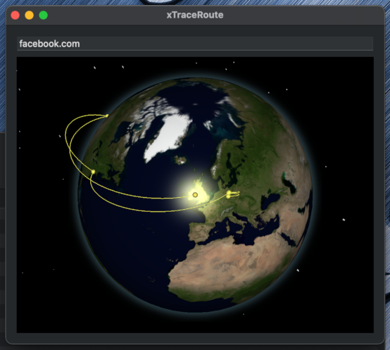

#  xTraceRoute for macOS

This is an Xcode project of an example implementation of xTraceRoute for macOS using [Swift-X3D](https://github.com/create3000/Swift-X3D).

It uses traceroute, and ipinfo.io to get the location of the servers. It displays each location on a 3D globe, with routes that connect the locations.

## Screenshots

### Studio Earth View

### Classic Earth View

